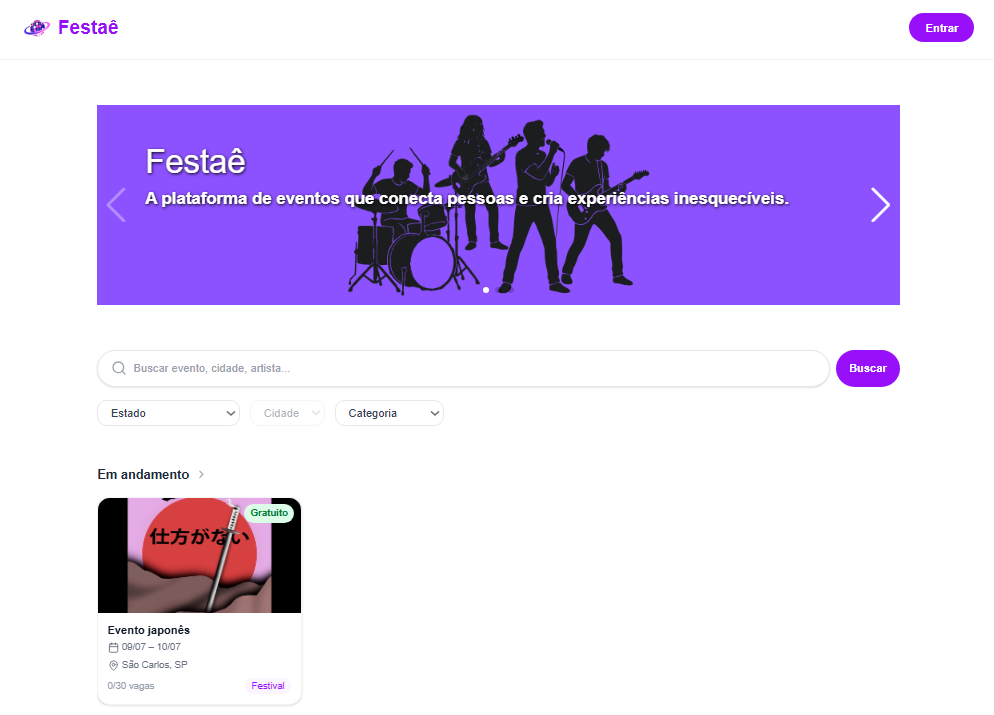

# Festae Events
Acesse o site 🔗 https://festae-events.vercel.app



Plataforma de descoberta e gestão de eventos com funcionalidades sociais integradas — criada como Trabalho de Conclusão de Curso, o projeto investiga como mecanismos de influência social, fundamentados nas teorias de **Leon Festinger** (comparação social) e **Robert Cialdini** (persuasão e prova social), podem elevar o engajamento e a venda de ingressos em plataformas de eventos online.

---

## ✨ Funcionalidades

- Descoberta de eventos com filtros por estado, cidade e categoria
- Criação e edição de eventos com upload de imagem
- Inscrição em eventos com integração ao **MercadoPago**
- Gerenciamento de amigos (enviar, aceitar e remover pedidos)
- Chat em tempo real — mensagens diretas e grupos
- Notificações de amizade, evento e mensagens não lidas
- Visualização de quais amigos estão inscritos em um evento
- Auto-complete de endereço por CEP via ViaCEP / IBGE
- Autenticação com Google via Supabase Auth
- Interface responsiva para desktop e mobile

---

## 🛠️ Tecnologias Utilizadas

- **Next.js 16** + **React 19** — framework full-stack
- **TypeScript** — tipagem estática
- **Tailwind CSS 4** — estilização
- **Supabase** — banco de dados, autenticação, storage e realtime
- **React Hook Form** + **Zod** — formulários e validação
- **MercadoPago SDK** — processamento de pagamentos
- **Swiper** — carousel de eventos
- **Jest** + **Testing Library** — testes automatizados
- **Vercel** — deploy

---

## 🚀 Como executar o projeto localmente

### Pré-requisitos

- Node.js 18+
- Uma conta Gmail Google (para autenticação)
- Uma conta no [Supabase](https://supabase.com) com projeto configurado 
- Uma conta no [MercadoPago Developers](https://www.mercadopago.com.br/developers)   

### Passos

```bash
git clone https://github.com/brenonlps/festae-events.git
cd festae-events
npm install
```

Crie um arquivo `.env.local` na raiz com as variáveis:

```env
NEXT_PUBLIC_SUPABASE_URL=sua_url_supabase
NEXT_PUBLIC_SUPABASE_ANON_KEY=sua_chave_anonima
MERCADOPAGO_ACCESS_TOKEN=seu_token_mercadopago
```

Inicie o servidor de desenvolvimento:

```bash
npm run dev
```

Acesse [http://localhost:3000](http://localhost:3000) no navegador.

---

## 🎯 Objetivo do Projeto

Investigar, na prática, como funcionalidades sociais — como ver quais amigos estão inscritos em um evento, chat integrado e rede de amizades — influenciam a decisão de compra de ingressos. O projeto aplica conceitos da **Teoria da Comparação Social de Festinger** e dos **Princípios de Influência de Cialdini** (prova social, pertencimento e reciprocidade) como base para as decisões de design e UX da plataforma.
